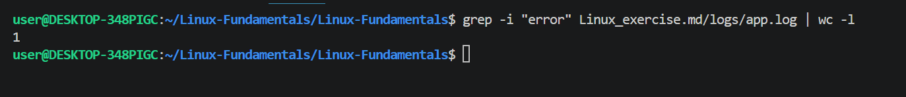
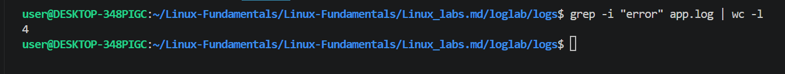
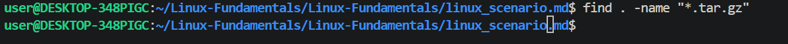
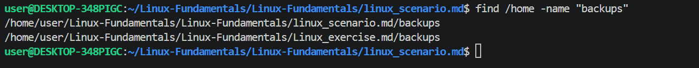
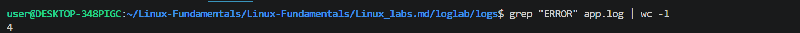
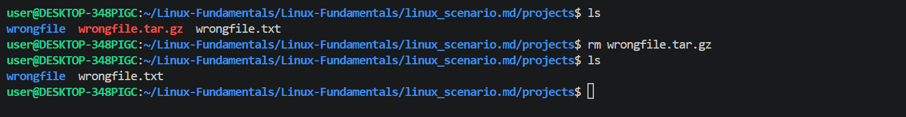

# Linux-Fundamentals

# PART 1 - File Management.

# Task 1 - Create Project Structure

On this task we created a structure with log, backup,script,configs, and temp directories

# Task 2 -Create Files

On the Directories we created earlier the app.log, deploy.sh and app.conf were created on there respective directories as shown on the directory tree below.

# Task 3 - Add Sample Content

On app.log file we added some contents.

INFO Server started \
WARNING Disk almost  full \
ERROR Database connection failed \
INFO User login successful \

# Task 4 - Copy Backup

We created a backup of app.conf file in the configs folder to backup directory,
to create a backup we used the "cp" command 

# PART 2 -File Viewing & Log Investigation
# Task 5 - Investigate Logs
 
This task wanted us to investigate the logs file that we created and find the errors and warning entries. we used the "find" command to do this.

find . -name "app.log" -exec grep -n "warning" {} \; 

find . - search from current directory
-name "app.log" - locate the file by name
-exec -execute a command on the found file
grep "ERROR" - searches for ERROR entries
{} - represents the found files
\; - ends the execute statement.

we searched the warning entries on the app.log file. 

# Task 6 - Monitor Logs Live

In this task we used the command "tail -f app.log " and added aome content to that file as we can see the content is being monitored in real life.

# PART 3 - Permissions & Ownership
# Script Permissions

In this task we have to change permissions for deploy.sh file to make it executable.

for permissions we always have the read, write and execute permissions.

we used the "chmod +x deploy.sh" this gives the file the execute command.

# Task 8 - Secure Config File (configs/app.conf)

We gave this file the read and write permissions by running the "chmod 600 app.conf" command.

# Task 9 - Explain Permissions

Explain:
755 - this means that the owner of the file has full permissions, the group has the read and execute permissions and the other users also have the read and execute permissions.
644 - this shows that the ownner has the read and write permissions, the group and other users have the read permissions only.
600 - this illustrates that the owner of the file has the read ans write permissions and the rest of the user have no permissions to perform any action.

# PART 4 - Process Management
# Task 10 - Start Background Process 

We have created a process on the background by running "sleep 500 &".

as we can see on the image below, the process was created.

# Task 11 - Identify Process

In this task we have to find the process ID(PID) and the process name. we used the command "ps aux | grep sleep "
from the results we can see the process ID is "11666i" and the process name is "sleep"

# Task 12 - Terminate Process

we  have to stop the sleep process we created earlier, we use the kill -9 <process id> command.

# Task 13 - Monitor System
 
By using the top command we are able to see the total number of processes the cpu usage and memeory usage.

# PART 5 - Networking & Connectivity

# Task 14 - Find Server IP
By the use of "ip a" command we are able to see an ip address 

To see the hostaneme of the server we are using we run the command "hostname"

# Task 15 - Test Connectivity
To test our linux machine internet access we pinged the google.com domain and as we can see it reachable sonce we have response from that domain.

# Task 16 - Verify Listening Ports
we used the command ss -tulnp to verif listening ports

# PART 6 - SSH & SCP
# Task 17 - Remote Access (Local to Remote)

# Task 18 -Secure  File Transfer

# Task 19 - Retrieve File (Remote to Local)

# PART 7 - Disk & System  Information

# Task 20 - Check  System Resources 
memory usage

Disk usage

uptime

linux version

# Task 21 - Analyze Storage

# PART 8 - Compression & Backup

# Task 22 - Create Backup Archive

# Task 23 - Extract

# LINUX_LAB

# PART 1 - FIND COMMAND

# Task 1 
in this task we have been asked to find all the .log files that we created at the beginning of the lab, we were to use the find command to do so.

# PART 2 - LOCATE COMMAND
# Task 3
we are to use the locate command to find a file auth.log

# PART 3 - GREP COMMAND
# Task 4

In this task we are to find error message in app.log file.

# Task 5
we are to find the warning text inside the app.log file.

# Task 6

we are to count the number of errors using the wc command by piping

# PART 4 - AWK COMMAND

# Task 7
on this task we are to print the timestamp in the file app.log file. 

# Task 8

# Task 9

On this task we rae to extract disk usage percentage from system.log

# PART 5 - PIPING

# Task 10

# Task 11

# Task 12

# PART 6 - XARGS

# Task 13

# Task 14

# Task 15

# ADVANCED CHALLENGE

The server is unstable.
identify disk issue

# Scenario questions

# File Management Scenarios

1. I created a file in the wrong directory by accident, how would i move the fie to the correct directory?
 -to move a file we use the command "mv" to move a file from one directory to another

2. A team needs a folder structure of logs, scripts and backup, how would all folders be created using one command.

 - To create a folder structure of three directories at once we use the "mkdir command"
 - in our case we did "mkdir logs script backup" and we created the three directories as shown.

3. A backup file is consuming a lot of space, how would you locate, copy to backup directory and delete the original?

- locate file
  - To locate a file we used the locate or find command 

- copy to backup

- delete the original

# File Viewing & Management Scenarios

4. Web application is failing, how would you view latest logs, continuously monitor updates.

 - to view the latest logs i would use the tail command which shows the most recent logs.
 - if i want to monitor the log data continuously i will use the "tail -f" this keeps the terminal open and displays new log entries as they are written.

5. You suspect the application has database errors, how would you search the log file for ERROR.

  - i would use the grep command on the file.

6. A configuration file is very large, which command would help you scroll through it page by page.

 - The less command

# Permissions & Ownership Scenarios

7. A deployment script called deploy.sh fails with permission denied, how would you fix it?

 - When most scripts are created they always don't give the file owner the permissions to execute so i would have to change the permissions to make it executable.
 - To fix this i would use the command "chmod +x deploy.sh" this will give the file the execute command.

8. We want the owner to read, write and execute a file, which permission number would you use? 

 - for the owner of the file to have full permissions we use the number 700 meaning any other user other than the owner has no permissions to do anything.

9. A file belongs to the wrong user, how would you change ownership to another user. 

 - To change file ownership we use the command "chown" command

10. You accidentally gave everyone write access to a sensitive file. why is this dangerous? 

 - The write permissions mean that the integrity of the file might be in jeoperdy because any user can modify, overwrite or delete the file content and this can lead to unauthorised changes and data corruption.

# Process Management Scenarios

11. A python application is consuming 95% CPU. which commands would help identify the process?

 - ps aux is a powerful command used to dentify the running processes and the cpu usage for each process.
 - We can also use the top and htop commands that give a more detailed interfaces 

12. A background process named "sleep" is running. how would you stop it?

 - first we need to know the process id of that process and we use  "ps aux | grep sleep" command to identify the id.
 - we can then use the kill <id> command to kill that process.  

13. Your server becomes slow, why is checking running processes important? 

 - By checking the running processes we can figure out which process is consuming a lot of cpu and memory resources this allows the administrator to diagnose and fis performance issues causing the server to slow down. 

14. You started a process accidentally in the background. How would you view background jobs?

 - To view background processes running  in the current shell session we use the "jobs" command. 

# Network & Connectivity scenarios
15. A student cannot connect to the internet from the Linux VM Which command would you use first to test connectivity?

 - when one is not able to reach the internet, we use the ping command to test connectivity  to find out if the host is reachable or not. 

16. You need to know the IP address of your Linux server, which command would you use?

 - To find out the ip address of your linux server we use the command "ip a" this displays network interfaces and their assigned ip addresses

17. A web server should be listening on port 80, which command helps confirm this?

ss -tulnp is a command used to display listening ports that, but to specifically find out if port 80 is listening we will have to grep out the response of the first command and do "ss -tulnp | grep :80"

18. A website domain is not resolving correctly, which commands can help troubleshoot DNS?

 - We use the nslookup, dig and host command to troubleshoot DNS resolution issues, these commands help verify whether a domain name is resolving to the correct ip address.

# SSH & Remote Access Scenarios
19. You need to remotely manage a Linux server from Windows, which command would you use?

 - We use "ssh" to remotely access a Linux server from the Windows machine through the command line.

20. You need to securely transfer a file from your local machine to a remote linux server, which command would you use?

 - To securely transfer a file from my local machine to remote Linux server we use the "scp" command. It copies files securely using ssh.

# Bonus Challenge Questions
21. why is Linux heavily used in cloud computing and DevOps?

 - Linux is used in cloud computing and devops mostly because it's more secure, and reliable, stable, and highly customizable it is well suited fpr automation and server management.

22. what is the difference between "chmod 755" and "chmod 644"

 - chmod 755 mean that the owner of the file has full permissions, the group and others have the read and execute permissions only
 - chmod 644 means the owner has read and write permissions whereas the group and other users have the read permission only.

23. why is "chmod +x script.sh" important before running scripts?

 - This is because it gives the script execute permissions, allowing it to run as a program or a command line in linux.

24. why is SSH considered more secure than older remote access methods?

 - SSH is more secure because it encrypts all data transmitted between the client and server, including usernames, passwords and commands. This prevents attackers from intercepting or reading sensitive information.
 - it also supports strong authentication methods such as key-based authentication, making unauthorized access more difficult.   

25. why is process management important in Docker and Kubernetes environments?

 -Process management is important in Docker and Kubernetes because it helps control and monitor running application processes, ensuring efficient use of CPU and memory. It also enables automatic restart of failed processes, supports scaling of applications, and enforces resource limits to maintain system stability and performance.

